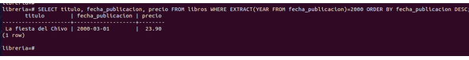
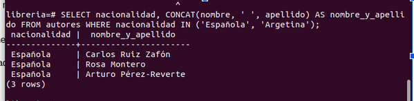
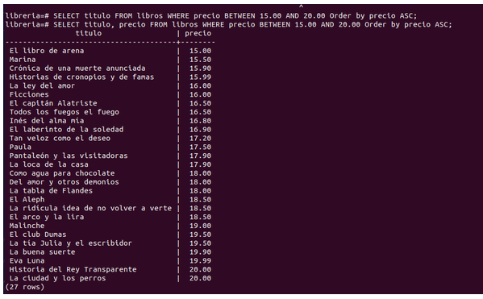
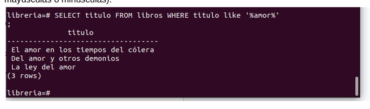
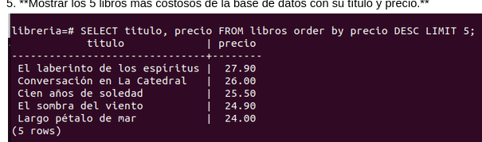
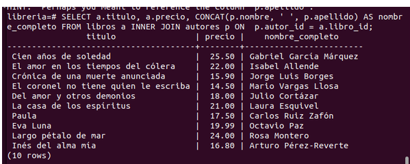
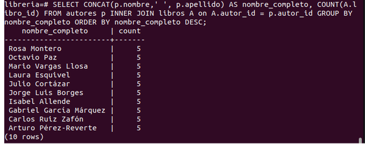
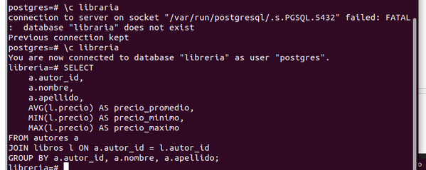
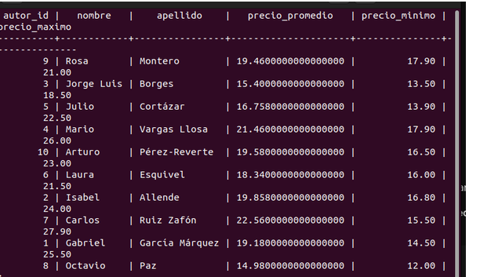
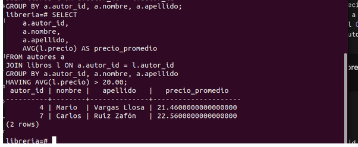

#
# EJERCICIOS DE REVIEW

Elabore las consultas para los siguientes enunciados:

1. **Obtener el título, fecha de publicación y precio de todos los libros publicados después del año 2000, ordenados del más reciente al más antiguo.**
SELECT titulo, fecha_publicacion, precio 
FROM libros 
WHERE EXTRACT(YEAR FROM fecha_publicacion) = 2000 
ORDER BY fecha_publicacion DESC;

2. **Listar los nombres completos (nombre y apellido en una sola columna) y la nacionalidad de todos los autores cuya nacionalidad sea 'Española' o 'Argentina'.**
+
SELECT nacionalidad, CONCAT(nombre, ' ', apellido) AS nombre_y_apellido 
FROM autores 
WHERE nacionalidad IN ('Española', 'Argentina');

3. **Consultar todos los libros cuyo precio esté entre $15.00 y $20.00 inclusive.**

SELECT titulo, precio 
FROM libros 
WHERE precio BETWEEN 15.00 AND 20.00 
ORDER BY precio ASC;

4. **Buscar todos los libros cuyo título contenga la palabra "amor" (sin importar si está en mayúsculas o minúsculas).**

SELECT titulo 
FROM libros 
WHERE titulo LIKE '%amor%';

5. **Mostrar los 5 libros más costosos de la base de datos con su título y precio.**

SELECT titulo, precio 
FROM libros 
ORDER BY precio DESC 
LIMIT 5;

6. **Mostrar el título del libro, el precio y el nombre completo del autor al que pertenece cada libro.**

SELECT 
    a.titulo, 
    a.precio, 
    CONCAT(p.nombre, ' ', p.apellido) AS nombre_completo 
FROM libros a 
INNER JOIN autores p ON p.autor_id = a.libro_id;

7. **Calcular la cantidad total de libros que ha escrito cada autor. Mostrar el nombre completo del autor y el total de libros, ordenados de mayor a menor.**

SELECT 
    CONCAT(p.nombre, ' ', p.apellido) AS nombre_completo, 
    COUNT(A.libro_id) 
FROM autores p 
INNER JOIN libros A ON A.autor_id = p.autor_id 
GROUP BY nombre_completo 
ORDER BY nombre_completo DESC;

8. **Obtener el precio promedio, el precio mínimo y el precio máximo de los libros publicados por cada autor.**

SELECT 
    a.autor_id,
    a.nombre,
    a.apellido,
    AVG(l.precio) AS precio_promedio,
    MIN(l.precio) AS precio_minimo,
    MAX(l.precio) AS precio_maximo
FROM autores a
JOIN libros l ON a.autor_id = l.autor_id
GROUP BY a.autor_id, a.nombre, a.apellido;

9. **Listar los autores que tienen un promedio de precio en sus libros superior a $20.00.**

SELECT 
    a.autor_id,
    a.nombre,
    a.apellido,
    AVG(l.precio) AS precio_promedio
FROM autores a
JOIN libros l ON a.autor_id = l.autor_id
GROUP BY a.autor_id, a.nombre, a.apellido
HAVING AVG(l.precio) > 20.00;

10. **Contar cuántos libros se han publicado por cada nacionalidad de los autores.**

SELECT 
    a.nacionalidad,
    COUNT(l.libro_id) AS total_libros
FROM autores a
JOIN libros l ON a.autor_id = l.autor_id
GROUP BY a.nacionalidad;

