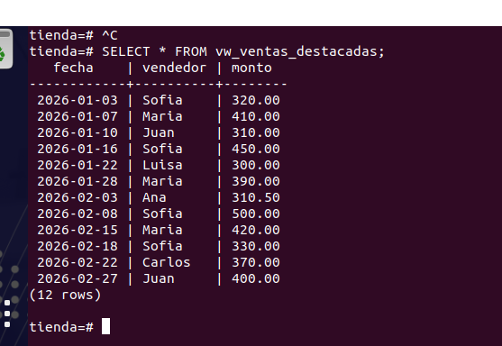
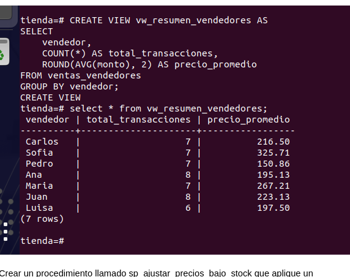
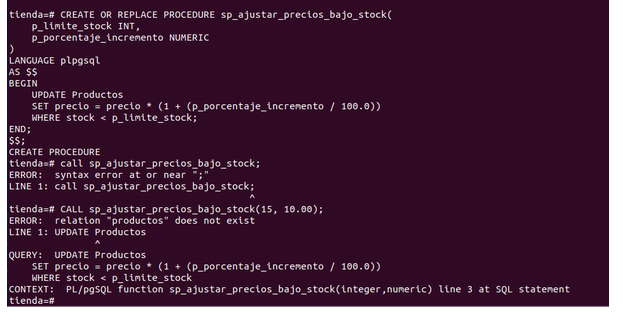
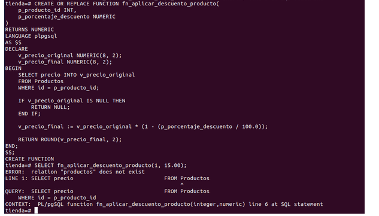

    Crear una vista llamada vw_ventas_destacadas que contenga únicamente los registros de ventas cuyo monto sea igual o superior a $300.00, incluyendo la fecha, el vendedor y el monto.

CREATE VIEW vw_ventas_destacadas AS
SELECT 
    fecha,
    vendedor,
    monto
FROM ventas_vendedores
WHERE monto >= 300.00;

   

    Crear una vista llamada vw_resumen_vendedores que muestre el nombre de cada vendedor, el número total de transacciones realizadas y el precio promedio de sus ventas redondeado a dos decimales.

CREATE VIEW vw_resumen_vendedores AS
SELECT 
    vendedor,
    COUNT(*) AS total_transacciones,
    ROUND(AVG(monto), 2) AS precio_promedio
FROM ventas_vendedores
GROUP BY vendedor;

    Crear un procedimiento llamado sp_ajustar_precios_bajo_stock que aplique un incremento porcentual al precio de todos los productos cuyo stock sea menor a cierto límite recibido por parámetro (por ejemplo, aumentar un 10% el precio a productos con menos de 15 unidades en existencia).
CREATE OR REPLACE PROCEDURE sp_ajustar_precios_bajo_stock(
    p_limite_stock INT,
    p_porcentaje NUMERIC
)
LANGUAGE plpgsql
AS $$
BEGIN
    UPDATE productos
    SET precio = precio * (1 + (p_porcentaje / 100))
    WHERE stock < p_limite_stock;
END;
$$;

    Crear una función llamada fn_aplicar_descuento_producto que reciba el id del producto y un porcentaje de descuento (por ejemplo, 15.00 para 15%). La función debe calcular el precio final restando el descuento al precio original.CREATE OR REPLACE FUNCTION fn_aplicar_descuento_producto(
    p_producto_id INT,
    p_porcentaje_descuento NUMERIC
)
RETURNS NUMERIC
LANGUAGE plpgsql
AS $$
DECLARE
    v_precio_original NUMERIC;
    v_precio_final NUMERIC;
BEGIN
    SELECT precio INTO v_precio_original 
    FROM productos 
    WHERE id = p_producto_id;

    v_precio_final := v_precio_original - (v_precio_original * (p_porcentaje_descuento / 100));

    RETURN v_precio_final;
END;
$$;

